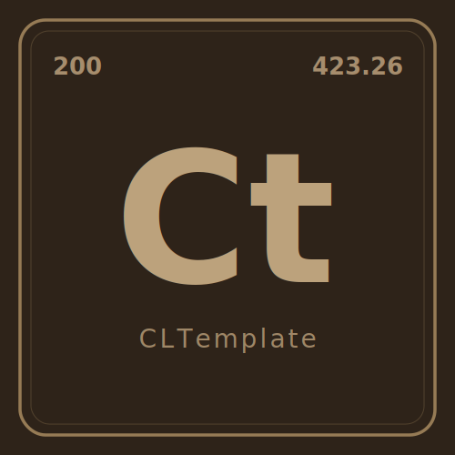

  <a href="https://github.com/CascadingLabs/{{PROJECT_NAME}}">
    <picture>
      <source media="(prefers-color-scheme: dark)" srcset="media/logo-dark.svg">
      <source media="(prefers-color-scheme: light)" srcset="media/logo-light.svg">
      
    </picture>
  </a>

  
  

# {{PROJECT_NAME}}

{{PROJECT_TAGLINE}}

## Usage

<!-- Quickstart: the one or two commands someone copy-pastes to try it. -->

## Development

<!-- Clone, install, run tests. -->

## Related projects

| Project        | Repo                                                                     |
|----------------|--------------------------------------------------------------------------|
| Cascading Labs | [github.com/CascadingLabs](https://github.com/CascadingLabs)             |
| Assets         | [github.com/CascadingLabs/Assets](https://github.com/CascadingLabs/Assets) |

## Community

- **Discord:** [discord.gg/c8MKEaWEEK](https://discord.gg/c8MKEaWEEK)
- **Support:** see [SUPPORT.md](SUPPORT.md)
- **Security:** see [SECURITY.md](SECURITY.md)
- **Code of Conduct:** see [CODE_OF_CONDUCT.md](CODE_OF_CONDUCT.md)

## Contact

[contact@cascadinglabs.com](mailto:contact@cascadinglabs.com)

## License

Apache 2.0 — see [LICENSE](LICENSE).
